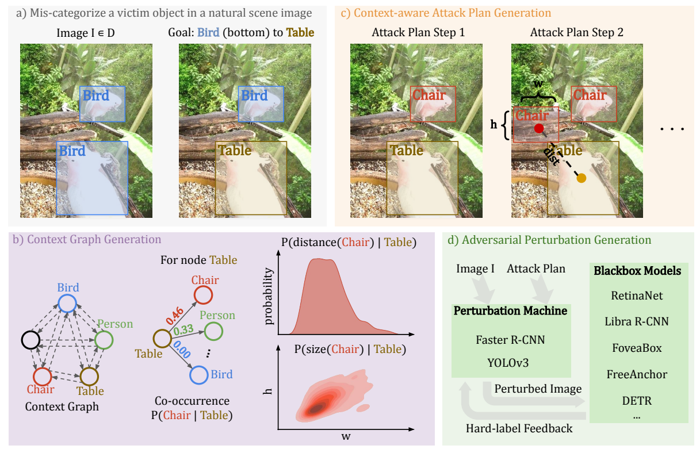

# Context-Aware Adversarial Attacks
### [Paper](http://arxiv.org/abs/2112.03223) | [Code](https://github.com/CSIPlab/context-aware-attacks) | [Slides](https://github.com/CSIPlab/context-aware-attacks/blob/main/doc/slides.pdf) | [Poster](https://github.com/CSIPlab/context-aware-attacks/blob/main/doc/poster.pdf) | [Video](https://aaai-2022.virtualchair.net/poster_aaai6996)

Pytorch implementation of *Context-Aware Transfer Attacks for Object Detection* in AAAI 2022.

[Context-Aware Transfer Attacks for Object Detection](http://arxiv.org/abs/2112.03223)  
 [Zikui Cai](https://zikuicai.github.io/), Xinxin Xie, Shasha Li, Mingjun Yin, Chengyu Song,Srikanth V. Krishnamurthy, Amit K. Roy-Chowdhury,
 [M. Salman Asif](https://intra.ece.ucr.edu/~sasif/)<br>
 UC Riverside 

Blackbox transfer attacks for image classifiers have been extensively studied in recent years. In contrast, little progress has been made on transfer attacks for object detectors. Object detectors take a holistic view of the image and the detection of one object (or lack thereof) often depends on other objects in the scene. This makes such detectors inherently context-aware and adversarial attacks in this space are more challenging than those targeting image classifiers. In this paper, we present a new approach to generate context-aware attacks for object detectors. We show that by using co-occurrence of objects and their relative locations and sizes as context information, we can successfully generate targeted mis-categorization attacks that achieve higher transfer success rates on blackbox object detectors than the state-of-the-art. We test our approach on a variety of object detectors with images from PASCAL VOC and MS COCO datasets and demonstrate up to 20 percentage points improvement in performance compared to the other state-of-the-art methods.




## Environment
See `requirements.txt`, some key dependencies are:

* python==3.7
* torch==1.7.0 
* mmcv-full==1.3.3


Install mmcv-full https://github.com/open-mmlab/mmcv.

```
pip install mmcv-full==1.3.3 -f https://download.openmmlab.com/mmcv/dist/{cu_version}/torch1.7.0/index.html
# depending on your cuda version
```

## Datasets
Get VOC and COCO datasets under `/data` folder.
```
cd data
bash get_voc.sh
bash get_coco.sh
```

## Object Detection Models
Get mmdetection code repo and download pretrained models.
```
cd detectors
git clone https://github.com/zikuicai/mmdetection
# This will download mmdetection package to detectors/mmdetection/

python mmdet_model_info.py
# This will download checkpoin files into detectors/mmdetection/checkpoints
```

## Attacks and Evaluation
Run sequential attack.
```
cd attacks/attack_mmdetection
python run_sequential_attack.py
```

Calculate fooling rate.
```
cd evaluate/fooling_rate
python get_fooling_rate.py
```

Run transfer attacks on different blackbox models.
```
cd attacks/attack_mmdetection
python run_transfer_attack.py
```

Calculate fooling rate again on blackbox results.
```
cd evaluate/fooling_rate
python get_fooling_rate.py -bb
```

## Overview of Code Structure
- data
    - script to download datasets VOC and COCO
    - indices of images used in our experiments   
- detectors
    - packages for object detectors
    - script to download the pretrained model weights
    - util and visualization functions for mmdetection models
- context
    - co-occurrence matrix
    - distance matrix
    - size matrix
- attacks
    - code to attack the detectors
    - code to transfer attack other blackbox detectors
- evaluate
    - code to calculate the fooling rate of whitebox and blackbox attacks


## Citation
```
@inproceedings{cai2021context,
  title={Context-Aware Transfer Attacks for Object Detection},
  author={Cai, Zikui and Xie, Xinxin and Li, Shasha and Yin, Mingjun and Song, Chengyu and Krishnamurthy, Srikanth V and Roy-Chowdhury, Amit K and Asif, M Salman},
  year={2022},
  booktitle={AAAI}
}
```
